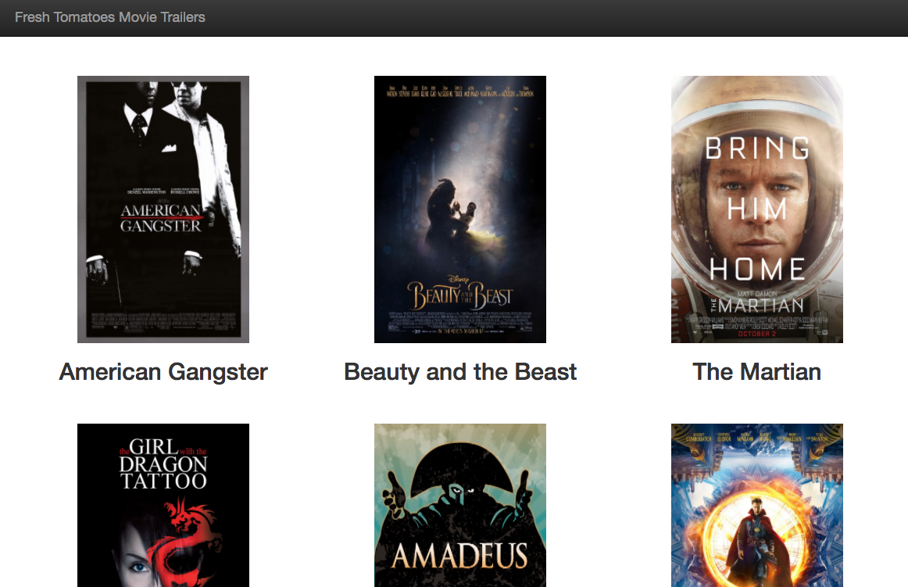

# The Udacity Movie Project

Basic Python Class to manage movie data + HTML, CSS, jQuery, Bootstrap for quick display

###Basic Installation

* Clone repo
* From the command line:
  -python entertainment_center.py
* Add your own favorite movies in: entertainment_center.py

###Files:

* media.py - the Movie class
* entertainment_center.py - instances of the Movie class + list of favorites
* fresh_tomatoes.py - builds and launches the latest fresh_tomatoes.html page
* README.md - this file
* .gitignore
* screenshot.png  (it'll look like this when you load the .html into a browser)

###Screenshot:

